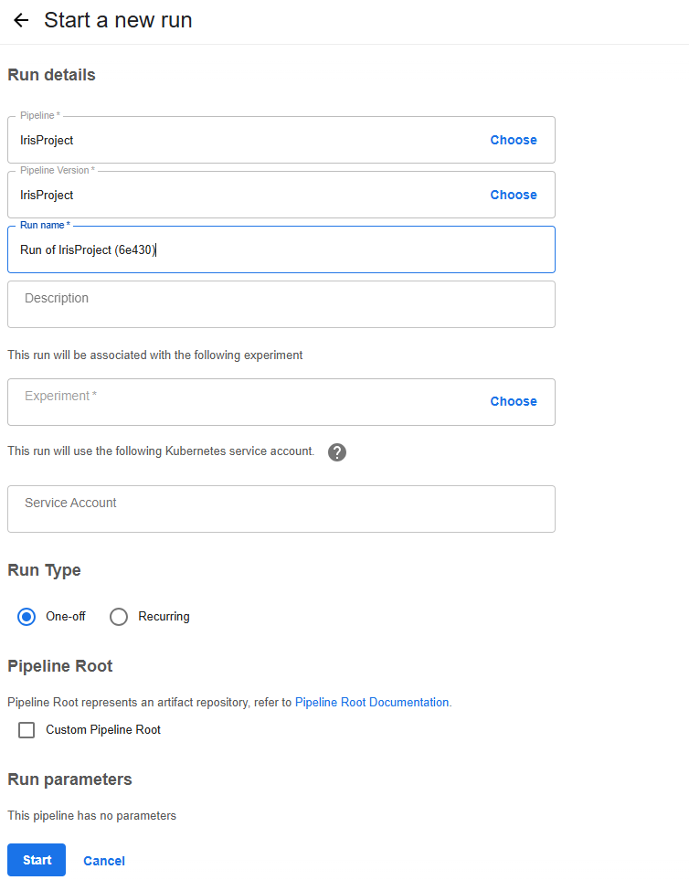

export PIPELINE_VERSION=2.4.0
kubectl apply -k "github.com/kubeflow/pipelines/manifests/kustomize/cluster-scoped-resources?ref=$PIPELINE_VERSION"

 kubectl wait --for condition=established --timeout=60s crd/applications.app.k8s.io
kubectl apply -k "github.com/kubeflow/pipelines/manifests/kustomize/env/platform-agnostic?ref=$PIPELINE_VERSION"

kubectl get ns
NAME                   STATUS   AGE
default                Active   140m
kube-node-lease        Active   140m
kube-public            Active   140m
kube-system            Active   140m
kubeflow               Active   126m
kubernetes-dashboard   Active   133m

kubectl get pods -n kubeflow
NAME                                                   READY   STATUS      RESTARTS       AGE
cache-deployer-deployment-86d88fd8-l2tm6               1/1     Running     0              126m
cache-server-699d6d4b58-qmvxz                          1/1     Running     0              126m
metadata-envoy-deployment-946867bf-9hgbk               1/1     Running     0              126m
metadata-grpc-deployment-6c44975f56-mjvnr              1/1     Running     6 (122m ago)   126m
metadata-writer-844c8c496d-qzdwz                       1/1     Running     1 (122m ago)   126m
minio-5d5574b5cd-9t2sh                                 1/1     Running     0              126m
ml-pipeline-7b8c745b88-bv768                           1/1     Running     2 (121m ago)   126m
ml-pipeline-8xfss-system-container-driver-1351616903   0/2     Completed   0              6m38s
ml-pipeline-8xfss-system-container-driver-1740384058   0/2     Completed   0              7m27s
ml-pipeline-8xfss-system-container-driver-2157042636   0/2     Completed   0              8m52s
ml-pipeline-8xfss-system-container-driver-703045280    0/2     Completed   0              5m51s
ml-pipeline-8xfss-system-container-impl-2277833670     0/2     Completed   0              5m41s
ml-pipeline-8xfss-system-container-impl-2740109218     0/2     Completed   0              8m42s
ml-pipeline-8xfss-system-container-impl-2969906868     0/2     Completed   0              7m17s
ml-pipeline-8xfss-system-container-impl-3352320617     0/2     Completed   0              6m28s
ml-pipeline-8xfss-system-dag-driver-4173759003         0/2     Completed   0              9m13s
ml-pipeline-persistenceagent-9cdb8686b-n5r54           1/1     Running     1 (122m ago)   126m
ml-pipeline-scheduledworkflow-bcfc5899-59d5c           1/1     Running     0              126m
ml-pipeline-ui-585dfd5955-kqbdg                        1/1     Running     0              126m
ml-pipeline-viewer-crd-cbb68b94-44th4                  1/1     Running     0              126m
ml-pipeline-visualizationserver-55c694986-ldmfh        1/1     Running     0              126m
ml-pipeline-wnmt8-system-container-driver-1293009282   0/2     Completed   0              15s
ml-pipeline-wnmt8-system-container-driver-1364318255   0/2     Completed   0              5s
ml-pipeline-wnmt8-system-container-driver-2526786180   0/2     Completed   0              25s
ml-pipeline-wnmt8-system-dag-driver-1022281107         0/2     Completed   0              35s
mysql-85fd58798-2thzg                                  1/1     Running     0              126m
workflow-controller-7bc7b46bfd-6g7hb                   1/1     Running     0              126m

 kubectl get all -n kubeflow
NAME                                                  READY   STATUS    RESTARTS      AGE
pod/cache-deployer-deployment-86d88fd8-l2tm6          1/1     Running   0             78m
pod/cache-server-699d6d4b58-qmvxz                     1/1     Running   0             78m
pod/metadata-envoy-deployment-946867bf-9hgbk          1/1     Running   0             78m
pod/metadata-grpc-deployment-6c44975f56-mjvnr         1/1     Running   6 (75m ago)   78m
pod/metadata-writer-844c8c496d-qzdwz                  1/1     Running   1 (75m ago)   78m
pod/minio-5d5574b5cd-9t2sh                            1/1     Running   0             78m
pod/ml-pipeline-7b8c745b88-bv768                      1/1     Running   2 (74m ago)   78m
pod/ml-pipeline-persistenceagent-9cdb8686b-n5r54      1/1     Running   1 (74m ago)   78m
pod/ml-pipeline-scheduledworkflow-bcfc5899-59d5c      1/1     Running   0             78m
pod/ml-pipeline-ui-585dfd5955-kqbdg                   1/1     Running   0             78m
pod/ml-pipeline-viewer-crd-cbb68b94-44th4             1/1     Running   0             78m
pod/ml-pipeline-visualizationserver-55c694986-ldmfh   1/1     Running   0             78m
pod/mysql-85fd58798-2thzg                             1/1     Running   0             78m
pod/workflow-controller-7bc7b46bfd-6g7hb              1/1     Running   0             78m

NAME                                      TYPE        CLUSTER-IP       EXTERNAL-IP   PORT(S)             AGE
service/cache-server                      ClusterIP   10.102.162.68    <none>        443/TCP             78m
service/metadata-envoy-service            ClusterIP   10.110.28.101    <none>        9090/TCP            78m
service/metadata-grpc-service             ClusterIP   10.106.167.159   <none>        8080/TCP            78m
service/minio-service                     ClusterIP   10.97.124.181    <none>        9000/TCP            78m
service/ml-pipeline                       ClusterIP   10.106.69.40     <none>        8888/TCP,8887/TCP   78m
service/ml-pipeline-ui                    ClusterIP   10.108.61.29     <none>        80/TCP              78m
service/ml-pipeline-visualizationserver   ClusterIP   10.99.229.14     <none>        8888/TCP            78m
service/mysql                             ClusterIP   10.110.180.147   <none>        3306/TCP            78m

NAME                                              READY   UP-TO-DATE   AVAILABLE   AGE
deployment.apps/cache-deployer-deployment         1/1     1            1           78m
deployment.apps/cache-server                      1/1     1            1           78m
deployment.apps/metadata-envoy-deployment         1/1     1            1           78m
deployment.apps/metadata-grpc-deployment          1/1     1            1           78m
deployment.apps/metadata-writer                   1/1     1            1           78m
deployment.apps/minio                             1/1     1            1           78m
deployment.apps/ml-pipeline                       1/1     1            1           78m
deployment.apps/ml-pipeline-persistenceagent      1/1     1            1           78m
deployment.apps/ml-pipeline-scheduledworkflow     1/1     1            1           78m
deployment.apps/ml-pipeline-ui                    1/1     1            1           78m
deployment.apps/ml-pipeline-viewer-crd            1/1     1            1           78m
deployment.apps/ml-pipeline-visualizationserver   1/1     1            1           78m
deployment.apps/mysql                             1/1     1            1           78m
deployment.apps/workflow-controller               1/1     1            1           78m

NAME                                                        DESIRED   CURRENT   READY   AGE
replicaset.apps/cache-deployer-deployment-86d88fd8          1         1         1       78m
replicaset.apps/cache-server-699d6d4b58                     1         1         1       78m
replicaset.apps/metadata-envoy-deployment-946867bf          1         1         1       78m
replicaset.apps/metadata-grpc-deployment-6c44975f56         1         1         1       78m
replicaset.apps/metadata-writer-844c8c496d                  1         1         1       78m
replicaset.apps/minio-5d5574b5cd                            1         1         1       78m
replicaset.apps/ml-pipeline-7b8c745b88                      1         1         1       78m
replicaset.apps/ml-pipeline-persistenceagent-9cdb8686b      1         1         1       78m
replicaset.apps/ml-pipeline-scheduledworkflow-bcfc5899      1         1         1       78m
replicaset.apps/ml-pipeline-ui-585dfd5955                   1         1         1       78m
replicaset.apps/ml-pipeline-viewer-crd-cbb68b94             1         1         1       78m
replicaset.apps/ml-pipeline-visualizationserver-55c694986   1         1         1       78m
replicaset.apps/mysql-85fd58798                             1         1         1       78m
replicaset.apps/workflow-controller-7bc7b46bfd              1         1         1       78m

kubectl port-forward -n kubeflow svc/ml-pipeline-ui 8080:80

PS C:\study\code\python\MLOps> .\venv\Scripts\kfp.exe pipeline create -p IrisProject .\kubeflow_pipeline.yaml
C:\study\code\python\MLOps\venv\lib\site-packages\kfp\client\client.py:159: FutureWarning: This client only works with Kubeflow Pipeline v2.0.0-beta.2 and later versions.
  warnings.warn(
Pipeline details: /pipeline/#/pipelines/details/3110f94d-9e84-486a-a9e4-2dbaeaaf7606
ID                                    NAME         CREATED AT
3110f94d-9e84-486a-a9e4-2dbaeaaf7606  IrisProject  2025-03-23T06:24:31+00:00

PS C:\study\code\python\MLOps> .\venv\Scripts\kfp.exe pipeline list
C:\study\code\python\MLOps\venv\lib\site-packages\kfp\client\client.py:159: FutureWarning: This client only works with Kubeflow Pipeline v2.0.0-beta.2 and later versions.
  warnings.warn(
ID                                    NAME                                          CREATED AT
3110f94d-9e84-486a-a9e4-2dbaeaaf7606  IrisProject                                   2025-03-23T06:24:31+00:00
abd33936-9c78-497b-91e2-d319a5b79aa4  [Tutorial] DSL - Control structures           2025-03-23T04:33:35+00:00
7839b36e-823f-4dbc-8fc4-46b6c72f85a9  [Tutorial] Data passing in python components  2025-03-23T04:33:34+00:00

