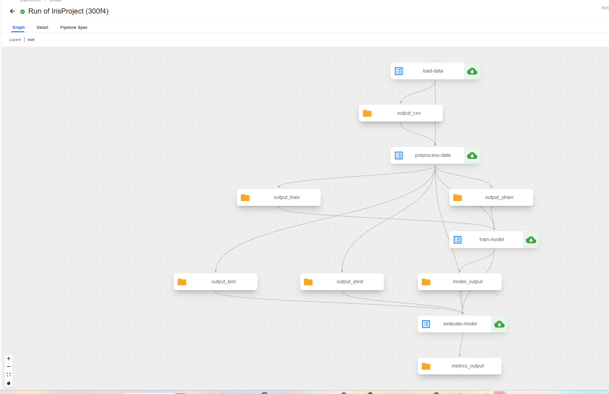

# Kubeflow Pipelines Installation and Usage


# Minikube Setup and Kubernetes Dashboard Access

This document outlines the steps taken to start Minikube, address potential issues, and access the Kubernetes Dashboard.

## Minikube Startup and Issue Resolution

1.  **Initial Minikube Start Attempt (VirtualBox Driver):**

    ```bash
    minikube start
    ```

    Output:

    ```
    * minikube v1.35.0 on Microsoft Windows 11 Home 10.0.26100.3476 Build 26100.3476
    E0323 12:10:25.117285  27356 start.go:812] api.Load failed for minikube: filestore "minikube": Docker machine "minikube" does not exist. Use "docker-machine ls" to list machines. Use "docker-machine create" to add a new one.
    * Using the virtualbox driver based on existing profile
    * Starting "minikube" primary control-plane node in "minikube" cluster
    * Creating virtualbox VM (CPUs=2, Memory=4000MB, Disk=20000MB) ...
    ! StartHost failed, but will try again: creating host: create: precreate: This computer doesn't have VT-X/AMD-v enabled. Enabling it in the BIOS is mandatory
    * Creating virtualbox VM (CPUs=2, Memory=4000MB, Disk=20000MB) ...
    * Failed to start virtualbox VM. Running "minikube delete" may fix it: creating host: create: precreate: This computer doesn't have VT-X/AMD-v enabled. Enabling it in the BIOS is mandatory

    X Exiting due to HOST_VIRT_UNAVAILABLE: Failed to start host: creating host: create: precreate: This computer doesn't have VT-X/AMD-v enabled. Enabling it in the BIOS is mandatory
    * Suggestion: Virtualization support is disabled on your computer. If you are running minikube within a VM, try '--driver=docker'. Otherwise, consult your systems BIOS manual for how to enable virtualization.
    * Related issues:
      - [https://github.com/kubernetes/minikube/issues/3900](https://github.com/kubernetes/minikube/issues/3900)
      - [https://github.com/kubernetes/minikube/issues/4730](https://github.com/kubernetes/minikube/issues/4730)
    ```

    **Note:** This failed due to VT-X/AMD-v being disabled.

2.  **Attempt to Start with Docker Driver (Incorrectly):**

    ```bash
    minikube start --driver=docker
    ```

    Output:

    ```
    * minikube v1.35.0 on Microsoft Windows 11 Home 10.0.26100.3476 Build 26100.3476
    E0323 12:11:24.879311  13124 start.go:812] api.Load failed for minikube: filestore "minikube": Docker machine "minikube" does not exist. Use "docker-machine ls" to list machines. Use "docker-machine create" to add a new one.

    ! Exiting due to GUEST_DRIVER_MISMATCH: The existing "minikube" cluster was created using the "virtualbox" driver, which is incompatible with requested "docker" driver.
    * Suggestion: Delete the existing 'minikube' cluster using: 'minikube delete', or start the existing 'minikube' cluster using: 'minikube start --driver=virtualbox'
    ```

    **Note:** This failed because a previous `minikube` instance existed with the `virtualbox` driver.

3.  **Delete Existing Minikube Instance:**

    ```bash
    minikube delete
    ```

    Output:

    ```
    * Removed all traces of the "minikube" cluster.
    ```

4.  **Start Minikube with Docker Driver (Correctly):**

    ```bash
    minikube start --driver=docker
    ```

    Output:

    ```
    * minikube v1.35.0 on Microsoft Windows 11 Home 10.0.26100.3476 Build 26100.3476
    * Using the docker driver based on user configuration
    * Using Docker Desktop driver with root privileges
    * Starting "minikube" primary control-plane node in "minikube" cluster
    * Pulling base image v0.0.46 ...
        > gcr.io/k8s-minikube/kicbase...:  500.31 MiB / 500.31 MiB  100.00% 29.27 M
    * Creating docker container (CPUs=2, Memory=4000MB) ...
    ! Failing to connect to [https://registry.k8s.io/](https://registry.k8s.io/) from inside the minikube container
    * To pull new external images, you may need to configure a proxy: [https://minikube.sigs.k8s.io/docs/reference/networking/proxy/](https://minikube.sigs.k8s.io/docs/reference/networking/proxy/)
    * Preparing Kubernetes v1.32.0 on Docker 27.4.1 ...
      - Generating certificates and keys ...
      - Booting up control plane ...
      - Configuring RBAC rules ...
    * Configuring bridge CNI (Container Networking Interface) ...
    * Verifying Kubernetes components...
      - Using image gcr.io/k8s-minikube/storage-provisioner:v5
    * Enabled addons: storage-provisioner, default-storageclass
    * Done! kubectl is now configured to use "minikube" cluster and "default" namespace by default
    ```

    **Note:** A warning about connectivity to `registry.k8s.io` was issued.

5.  **Verify Minikube Status:**

    ```bash
    minikube status
    ```

    Output:

    ```
    minikube
    type: Control Plane
    host: Running
    kubelet: Running
    apiserver: Running
    kubeconfig: Configured
    ```

## Kubernetes Dashboard Access

1.  **Start Kubernetes Dashboard:**

    ```bash
    minikube dashboard
    ```

    Output:

    ```
    * Enabling dashboard ...
      - Using image docker.io/kubernetesui/metrics-scraper:v1.0.8
      - Using image docker.io/kubernetesui/dashboard:v2.7.0
    * Some dashboard features require the metrics-server addon. To enable all features please run:

            minikube addons enable metrics-server

    * Verifying dashboard health ...
    * Launching proxy ...
    * Verifying proxy health ...
    * Opening [http://127.0.0.1:60014/api/v1/namespaces/kubernetes-dashboard/services/http:kubernetes-dashboard:/proxy/](http://127.0.0.1:60014/api/v1/namespaces/kubernetes-dashboard/services/http:kubernetes-dashboard:/proxy/) in your default browser...
    ```

    **Note:** This command opens the Kubernetes Dashboard in the default web browser.

This document provides a clear record of the steps and issues encountered during the Minikube setup and Kubernetes Dashboard access.

This document outlines the steps taken to install Kubeflow Pipelines and execute a pipeline.


## Installation

1.  **Set Pipeline Version:**

    ```bash
    export PIPELINE_VERSION=2.4.0
    ```

2.  **Apply Cluster-Scoped Resources:**

    ```bash
    kubectl apply -k "[github.com/kubeflow/pipelines/manifests/kustomize/cluster-scoped-resources?ref=$PIPELINE_VERSION](https://www.google.com/search?q=https://github.com/kubeflow/pipelines/manifests/kustomize/cluster-scoped-resources%3Fref%3D%24PIPELINE_VERSION)"
    ```

3.  **Wait for CRD Establishment:**

    ```bash
    kubectl wait --for condition=established --timeout=60s crd/applications.app.k8s.io
    ```

4.  **Apply Platform-Agnostic Environment:**

    ```bash
    kubectl apply -k "[github.com/kubeflow/pipelines/manifests/kustomize/env/platform-agnostic?ref=$PIPELINE_VERSION](https://www.google.com/search?q=https://github.com/kubeflow/pipelines/manifests/kustomize/env/platform-agnostic%3Fref%3D%24PIPELINE_VERSION)"
    ```

5.  **Verify Namespaces:**

    ```bash
    kubectl get ns
    ```

    Output:

    ```
    NAME                   STATUS   AGE
    default                Active   140m
    kube-node-lease        Active   140m
    kube-public            Active   140m
    kube-system            Active   140m
    kubeflow               Active   126m
    kubernetes-dashboard   Active   133m
    ```

6.  **Verify Kubeflow Pods:**

    ```bash
    kubectl get pods -n kubeflow
    ```

    Output:

    ```
    NAME                                                   READY   STATUS      RESTARTS       AGE
    cache-deployer-deployment-86d88fd8-l2tm6               1/1     Running     0              126m
    cache-server-699d6d4b58-qmvxz                          1/1     Running     0              126m
    metadata-envoy-deployment-946867bf-9hgbk               1/1     Running     0              126m
    metadata-grpc-deployment-6c44975f56-mjvnr              1/1     Running     6 (122m ago)   126m
    metadata-writer-844c4c496d-qzdwz                       1/1     Running     1 (122m ago)   126m
    minio-5d5574b5cd-9t2sh                                 1/1     Running     0              126m
    ml-pipeline-7b8c745b88-bv768                           1/1     Running     2 (121m ago)   126m
    ml-pipeline-8xfss-system-container-driver-1351616903   0/2     Completed   0              6m38s
    ml-pipeline-8xfss-system-container-driver-1740384058   0/2     Completed   0              7m27s
    ml-pipeline-8xfss-system-container-driver-2157042636   0/2     Completed   0              8m52s
    ml-pipeline-8xfss-system-container-driver-703045280    0/2     Completed   0              5m51s
    ml-pipeline-8xfss-system-container-impl-2277833670     0/2     Completed   0              5m41s
    ml-pipeline-8xfss-system-container-impl-2740109218     0/2     Completed   0              8m42s
    ml-pipeline-8xfss-system-container-impl-2969906868     0/2     Completed   0              7m17s
    ml-pipeline-8xfss-system-container-impl-3352320617     0/2     Completed   0              6m28s
    ml-pipeline-8xfss-system-dag-driver-4173759003         0/2     Completed   0              9m13s
    ml-pipeline-persistenceagent-9cdb8686b-n5r54           1/1     Running     1 (122m ago)   126m
    ml-pipeline-scheduledworkflow-bcfc5899-59d5c           1/1     Running     0              126m
    ml-pipeline-ui-585dfd5955-kqbdg                        1/1     Running     0              126m
    ml-pipeline-viewer-crd-cbb68b94-44th4                  1/1     Running     0              126m
    ml-pipeline-visualizationserver-55c694986-ldmfh        1/1     Running     0              126m
    ml-pipeline-wnmt8-system-container-driver-1293009282   0/2     Completed   0              15s
    ml-pipeline-wnmt8-system-container-driver-1364318255   0/2     Completed   0              5s
    ml-pipeline-wnmt8-system-container-driver-2526786180   0/2     Completed   0              25s
    ml-pipeline-wnmt8-system-dag-driver-1022281107         0/2     Completed   0              35s
    mysql-85fd58798-2thzg                                 1/1     Running     0              126m
    workflow-controller-7bc7b46bfd-6g7hb                   1/1     Running     0              126m
    ```

7.  **Verify all Kubeflow resources:**

    ```bash
    kubectl get all -n kubeflow
    ```

    Output:

    ```
    NAME                                                  READY   STATUS    RESTARTS      AGE
    pod/cache-deployer-deployment-86d88fd8-l2tm6          1/1     Running   0             78m
    pod/cache-server-699d6d4b58-qmvxz                     1/1     Running   0             78m
    pod/metadata-envoy-deployment-946867bf-9hgbk          1/1     Running   0             78m
    pod/metadata-grpc-deployment-6c44975f56-mjvnr         1/1     Running   6 (75m ago)   78m
    pod/metadata-writer-844c8c496d-qzdwz                  1/1     Running   1 (75m ago)   78m
    pod/minio-5d5574b5cd-9t2sh                            1/1     Running   0             78m
    pod/ml-pipeline-7b8c745b88-bv768                      1/1     Running   2 (74m ago)   78m
    pod/ml-pipeline-persistenceagent-9cdb8686b-n5r54      1/1     Running   1 (74m ago)   78m
    pod/ml-pipeline-scheduledworkflow-bcfc5899-59d5c      1/1     Running   0             78m
    pod/ml-pipeline-ui-585dfd5955-kqbdg                   1/1     Running   0             78m
    pod/ml-pipeline-viewer-crd-cbb68b94-44th4             1/1     Running   0             78m
    pod/ml-pipeline-visualizationserver-55c694986-ldmfh   1/1     Running   0             78m
    pod/mysql-85fd58798-2thzg                             1/1     Running   0             78m
    pod/workflow-controller-7bc7b46bfd-6g7hb              1/1     Running   0             78m

    NAME                                      TYPE        CLUSTER-IP       EXTERNAL-IP   PORT(S)             AGE
    service/cache-server                      ClusterIP   10.102.162.68    <none>        443/TCP             78m
    service/metadata-envoy-service            ClusterIP   10.110.28.101    <none>        9090/TCP




## Sources

* [iQuantC/Kubeflow-pipeline](https://github.com/iQuantC/Kubeflow-pipeline) - Used as a reference and inspiration for Kubeflow pipeline implementation.